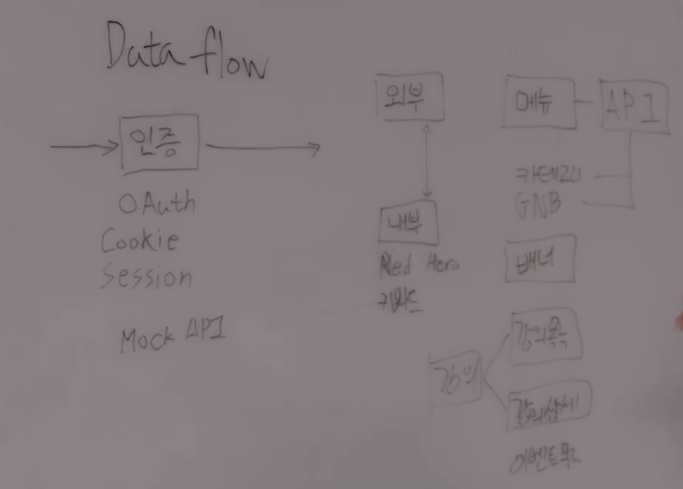

# 프론트엔드 실무 가이드2

패스트캠퍼스 - 조은의 프론트엔드 실무 가이드 : 요구사항 분석과 적정 기술

## 프론트엔드 개발자는 어디까지 알아야 하는가 ?

### BackEnd 관련 지식

1. 네트워크 => http
2. Restful API => API 설계구조
3. DB구조 => MockAPI를 만들기 위해
   - RDB
   - NoSql
4. JSON
5. GraphQL
6. SQL

### client 관련 지식

1. 브라우저, OS, Mobile, Descktop 별 특징
2. Content format

- 이미지 - png, jpg. webp
- 비디오 - mp4, mpeg, vp9, av1
  - 유튜브에서 8K 비디오를 지원하고 있는 데, 이를 지원하는 근간이 av1 코덱에서 나옴, 이러한 것들을 알고 있어야 내가 만드는 서비스에서 4K를 지원하려면 어떠한 포맷을 써야하는 지 이해를 해야함.
- 오디오
- 텍스트 - plan text

### UX(좀 더 욕심내면 여기까지..)

### 인프라

- 배포를 어떻게 할 건지
- AWS
- Serverless
- Docker
- CDN
- S3
- DevOps
- Monitor
- Log

#### 웹 전체를 아우를 수 있는 지식을 갖추는 것이 좋은 개발자

## 웹 전체를 아우르는 문제 정리하기

- 디테일한 부분 제외 웹을 굴리기 위해 기초적으로 신경써야하는 것 => 서버를 구축하고 모니터링하고 스케일링 가능한 구조로 만들고 트래픽을 버틸 수 있게 만드는 것

#### 그래서 이걸 어떻게 해야하는 가 ?

- 스케일링에 대한 이해를 가지려면 ? => 서버의 가용성을 알아야 함.
  - aws, vercel 사용하면 기본적으로 서버 가용성을 보여줌
  * 만약 가용성이 100%가 되면 서버를 늘릴 지 죽일 지 결정 => 서버에 대한 스케일링 정책은 PO와 상의

* **트래픽의 발생을 줄이는 게 중요**
  - 리소스의 크기
  * 캐싱
  - DB와 얼마나 자주 통신하는 가

## 브라우저 렌더링

- **레아아웃을 발생시키는 속성(ex : position)을 사용하면 60프레임을 유지하기가 어렵다.**
  - position 속성으로 애니메이션 변경 시 레이아웃 발생 시켜서 60프레임 유지 어려움
  - transform 사용해서 위치 이동 시 레이아웃 발생 안 시키고 페인트만 발생해서 기본적으로 60프레임 유지 가능
    - will-change를 써서 gpu를 극대화해서 사용하는 방법도 있음
      > - will-change css 속성은 요소의 변화를 미리 브라우저에게 알려주어 브라우저가 미리 최적화를 하게 할 수 있는 속성, 남발하면 안좋다고 함

## 웹에서 사용하는 렌더링 방식

### CSR

- csr은 왜 나왔는가 !?
  - 예전엔 pageA => pageB로 넘어가는 동작이 부자연스러움, 페이지 이동 시 하얀 화면, 새로고침을 해야지만 새로운 데이터를 받아올 수 있었음. => traditional Web

* js 번들의 크기가 커짐
* dom을 브라우저에서 만들어서 브라우저 컴퓨팅 파워를 많이 씀. => 렌더링 퍼포먼스 저하
* 한번 렌더링을 시키고 나면 그 다음에는 필요한 부분만 렌더링해서 성능상의 이점이 없지는 않음
* facebook, instagram, gmail, google docs와 같이 **실시간성이 보장되고 유지시켜주어야 하는 서비스**에 csr이 적합.
* 뉴스 기사를 보여주는 사이트와 같은 곳은 적합하지 않음

### SSR

- csr의 반대, 서버에서 렌더링

* 서버의 컴퓨팅 파워를 이용해서 콘텐츠를 좀 더 빠르게 렌더링 시키는 것
* 어떨 떄 쓰냐 ? => 웹 콘텐츠가 많을 때
  - csr보다 ssr이 빠름
* ssr과 csr을 필요에 맞게 병행해서 사용 => 실시간성이 필요없는 일부 컨텐츠들는 ssr, 그렇지 않은 경우 csr 사용

- 예전에는 브라우저가 새로고침을 하면 반드시 흰 화면이였는 데, 요즘 브라우저들은 이전 화면을 유지시켰다가 1초이내에 새로고침이 이루어지고 순차 렌더링을 하기 때문에 ssr 을 사용해도 spa처럼 동작하는데 크게 문제안됨.

* 예전의 ssr과 현재의 ssr은 다름
* NextJS
* node template engine

### SSG

- 정적사이트 생성

* 사이트 빌드 시점에 미리 html 만듬
* 사이트를 생성하는 시점에만 API에 대한 부하가 발생함으로 csr,ssr에 비해 api서버에 대한 부하가 훨씬 줄어듬
* NextJS는 SSR, SSG 둘다 지원
  - 상세페이지 만들때는 SSG로 만들고
  * 상세페이지가 아닌 일반 목록 페이지만들 때는 SSR 사용하는 아키텍처가 가능함
* Gatsby 라이브러리 => 정적사이트를 만드는 데 필요한 모든 것들 지원, NextJS보다 더 SSG에 최적화

#### 한 가지에 치중되지말고 제공하는 서비스에 맞게 적절히 섞어서 사용

## 프론트엔드 개발자가 알아야하는 MSA 아키텍처

### Micro frontends

- MSA(Micro Service Architecture)에서 가장 중요한 개념은 격리 => 서비스 단위로 각각 연동은 되어있지만 각각 죽던 살아나던 알아서 동작하는 것
  - 결제, 상품 서비스가 있다면 각자 움직이면 됨

* 프론트엔드(FE)에서는 MSA아키텍처라고 하더라도 FE코드자체가 한 베이스라면, 만약 결제페이지를 만든다고 하면 결제 페이지 내부에 결제, 상품, 장바구니 API와 모두 연동되는 구조임.

  - FE 입장에서는 결제, 상품,장바구니 중 하나라도 죽으면 FE 전체가 죽는 상황이 발생할 수 있는 것임.

* 즉, 백엔드(BE)는 MSA로 잘 적용했는데 FE가 아키텍처를 그대로 유지한다면 BE가 MSA로 전환한 것에 대한 대응이 상대적으로 잘 안된 것임.

#### FE도 BE의 MSA에 잘 대응하기 위해 나온 것이 **Micro Frontend Architecture**임.

- MSA가 나오는 만큼 FE가 나오게 됨.

* 결제 FE, 상품 FE, 장바구니 FE 각각 만들게 된다. 이렇게 될 경우 배포주기가 그만큼 많아지긴 하지만 결제가 죽으면 결제에만 영향이 가지 상품/장바구니에는 영향이 가지 않는 장점이 있음
* 결제/상품/장바구니 FE를 모아서 결제페이지를 만들게 됨.
* 이 결제페이지는 각각의 FE들을 어떤 방식으로든 가져와서 하나의 페이지로 구성함.
  - 구성하는 방법에는 굉장히 다양한 방법이 있음.
* **MFA에서 권장하는 방식 중 하나는 iframe을 이용하는 방법**

  - 장점

    - 완벽한 격리

  - 단점

    - UX관점에서 보면 결제페이지인데 결제서비스가 안된다는 문구를 보면 과연 이게 맞는 것 인가 ?
    - 개발자가 많이 필요함., 서비스가 여러개인 만큼

* **또 다른 방법으로 monorepo를 만들어서 여러 패키지를 만들고 이런 패키지들을 import해서 구현하는 방식이 있다.** => 관심사만 분리
  - 결제, 상품, 장바구니를 패키지로 구현하고 이 패키지가 각각 API를 바라보기는 하지만 이 패키지를 가져가서 쓰는 곳에서는 그냥 하나로 뭉쳐주기만 한다.
  * 좀 더 유연한 구조의 MFA

### BFF(Backends for Frontend)

- MSA와 MFA 사이에 BFF라는 API 레이어를 하나 두는 것
- API 게이트웨이가 하는 일과 API Converting 등을 수행함.
  - MSA에서 1000000이란 데이터를 준다면 웹에서 보여줄 때 1,000,000으로 포맷팅을 해서 보여주어야 한다고 가정을 해보면
  * MSA에서 포맷처리해서 줄 수도 있고 웹에서 할 수도 있음. 즉, 어느 레이어에서 이걸 수행해야하는 가에 대한 고민의 여지가 생김, 이를 BFF 처리

* BFF는 사이에서 중계를 해주면서 데이터를 정제, 포맷팅 즉 가공하는 역할을 수행
* wep/ app 둘다 각자 BFF 관리하면 됨.
* BFF에서 추상화도 시킬 수 있다.

  - 예를 들어, 결제/장바구니 MSA가 있다면 장바구니에 있는 아이템을 가져와서 결제에 보내주어야 하는 플로우가 있는 데

  * 이런 플로우를 FE에선 그냥 pay라는 이름으로 부르고 BFF에서 pay라는 이름의 추상화 레이어를 만들고 이 pay가 장바구니를 가져와서 다시 결제api까지 쏴주는 역할까지를 수행해줄 수 있는 것

  - 이런식으로 클라이언트 사이드에서 필요한 비즈니스로직 일부를 BFF가 가져감으로써 조금 더 프론트엔드 자체가 해야하는 역할을 줄이고 BFF에서 추상화된 로직으로 처리할 수 있도록 만들어 주는 것

* 얘는 모놀리틱에선 쓸모없다.

## 요즘 유행하는 기술들을 왜쓰는 지 !?

### React

#### 왜 많이 사용하느냐 ?

1. 강력한 커뮤니티

   - 리액트의 뒤에는 페이스북이 있다. => 본인들의 서비스를 이걸로 만들고 있기 때문에 망하진 않을 것이다.

2. 확장성

   - NextJS
   - Gestby

   * React Router Dom

3. React Native

   - 물론 다른 부분이 있지만, React의 사용을 촉진 시킨 것은 분명

4. 경쟁 상대의 부재

   - Angular => 해결하려는 문제 차제가 리액트와 완전히 다름
     - 리액트는 좀 더 UI 자체에 포커싱, Angular는 웹 애플리케이션의 행위에 좀 더 포커싱되어 있다

   * Vue => 순수한 오픈 소스, 리액트는 기업의 오픈소스, 바라보는 관점 자체가 다름
     - 기업의 오픈소스가 상대적으로 업데이트 주기가 빠름, 고객 지원, 문서화도 잘 되어 있음

#### 왜 function component 쓰는 가?

- class로 생성해서 사용 시 굉장히 장황함 extends로 component도 받아야하고 class name도 선언해주어야 하고.. 객체지향에서는 필요한 일이지만, React에서 element를 생성하는 관점에선 불필요한 일들을 한다는 느낌을 줌

* 그에 반해, 함수형은 return으로 jsx를 넘겨주기만 하면 됨. 더 직관적임
* 왜 예전에는 함수형 사용안했나 ?

  - 리액트의 라이프 사이클이 안되었었음.

  * React Hooks 나타남.
  * Hooks : A라는 액션이 실행될 때 A라는 액션과 동시에 같이 진행되는 함수를 정의하는 것을 지칭

* 지금엔 class보다 실행되는 속도가 더 빠름
* custom hooks를 사용하여 비즈니스 로직과 ui로직 분리도 가능

### Typescript

#### 왜 사용 ?

- interface가 어떻게 생겼고, 이 interface를 어떻게 정의하면 되는 지 정리 가능.
- 단순히 javascript에서 API어떻게 생겼는 지 계속 탐색하는 것이 아니라, 처음에 interface 정의를 잘 해놓고 나중에 가져다 쓰기만 하면 되니까 생산성에 훨씬 도움이 됨.

### GraphQL

#### 왜 사용 ?

- client 에서 사용할 데이터를 직접 스키마 정의

* Rest API는 직접 스키마 정의 못함. 이를 사용함으로 써 read에 들어가는 리소스를 많이 줄여줌.

## 강의 예제 프로젝트 진행하면서 memo

- 모든 프로젝트 시작 시 README 작성은 필수!! => SAMPLE_README 템플릿 참고

* Babel 설정은 가급적이면 하라 !

  - NextJS에선 기본적으로 IE11을 지원하지만, Babel에서 프리셋을 별도로 설정해줬을 때 빌드되는 결과물이 달라짐. 그래서 반드시 설정해줘야 IE11이 디폴트로 대응이 됨.
  - 완전 최근 스팩들도 빌트인 시점을 지원안하는 경우가 있음. 이런 케이스들도 방지하기 위해

  * Nextjs custom babel참고(https://nextjs.org/docs/pages/building-your-application/configuring/babel)

* exlint는 airbnb꺼 설치해서 사용
  ```
  npm install eslint-config-airbnb-typescript \
            @typescript-eslint/eslint-plugin@^6.0.0 \
            @typescript-eslint/parser@^6.0.0 \
            --save-dev
  ```
* .github 폴더 생성 후 CODEOWNERS 작성
  - CODEOWNERS파일은 무엇이냐 ? => pr을 날리거나 개발을 진행할 때 이사람이 코드의 관리자다라는 걸 지정해주는 파일
  * 이를 활용하면 코드리뷰를 위해 PR 생성 시, 작업한 파일에 관련된 Owner들을 자동으로 PR(Pull Request) Reviewer로 지정할 수 있다.
  ```
  * @techhtml => 이 저장소내에서 일어나는 모든 일에 대해 리뷰어로 붙게 됨
  ```
* 코드오너를 설정하는 것과 리뷰어를 설정하는 것의 차이 ? => 코드오너를 설정해두면 github에 프로텍션룰에 코드오너가 리뷰를 남겼을 때에만 머지를 시킬 수 있는 항목같은 게 존재, 단순히 리뷰어를 지정하는 것과 다름. 코드오너가 저장소의 모든 이슈들을 신경쓰기 때문에 이런식으로 코드오너를 지정해두는게 추후에 굉장히 많은 도움이 됨
* 테스트는 nextjs 공식문서 참고해서 설치(https://nextjs.org/docs/pages/building-your-application/optimizing/testing#setting-up-jest-with-the-rust-compiler)

```
  npm install --save-dev jest jest-environment-jsdom @testing-library/react @testing-library/jest-dom

```

- 커스텀 .babelrc를 사용할 경우 nextjs는 컴파일러를 사용안한다구함.. ?
  그래서 위 링크의 Setting up Jest(width Babel)참고해서 진행

* 위 명령어에 추가로 아래 모듈 설치

```
  npm install babel-jest identity-obj-proxy
```

- 모든 프로젝트의 배포는 가장 중요한 부분 ! 해당 프로젝트에선 dockerfile 만들어서 사용
  - 도커컨테이너를 EKS같은 컨테이너 서비스에 배포만 하면 바로 서비스가 노출됨.

* github action : github 내에서 사용하는 CI

### 해당 강의에서 애플리케이션 개발하기

1. 데이터 플로우 그리기
2. 유저 시나리오 작성하기
3. 페이지 생성하기
4. 컴포넌트 생성하기
5. Mock API 생성하기
6. UseQuery로 데이터 가져오기
7. Custom Hooks로 Hooks 레이어 빼내기

#### 1. 데이터 플로우 그리기

- **모든 프로젝트를 시작하기 전에 데이터 플로우를 우선 그려라**
- 데이터 플로우를 파악하고 백엔드개발자와 협의해서 진행
- 프론트에서 MockAPI를 만들어서 이런식으로 만들어달라고 제안해도 됨.

* 아래 이미지는 예제 프로젝트인 fastcampus site 데이터 플로우 짠 것
  - 인증에 대한 데이터 플로우가 하나 있고 이 인증을 바탕으로 패스트캠퍼스 메인 사이트에 들어왔을 때
  - 외부 api 메뉴, 배너, 강의, 이벤트를 가져오고
  - 내부 api 히어로(패캠 강의에서 the red 강의의 hero), 키워드 api 이 두가지 사용
    
* 이렇게 미리 짜도 당연히 개발을 하다보면 안맞을 수 있음, 이런 것들은 비즈니스 하면서 협의
* api를 첫 설계해둔걸 변경 못하는 게 아니기 때문에 데이터 플로우를 설계해서 필요한 데이터를 정리하고 프로젝트를 진행하는 것이 중요

#### 2. 데이터 플로우 그리기

- 데이터 플로우 작성 후 **유저 시나리오도 작성**

- 유저 시나리오란, 유저가 이 사이트에 들어왔을 때 어떤 액션을 일으킬지, 즉 어떻게 이용할 지 정리하는 것

- 모든 시나리오를 다쓰는 방법도 있지만, 엣지 포인트 하나를 대표적으로 뽑아서, 이에 대한 검증을 먼저 진행하는 것도 좋은 방법(MVP 방법론 중 하나) => 가장 기본적인 유저의 액션만 제일 처음 구현해놓고 그 다음 고도화 시켜나가는 방법
- 유저 시나리오를 작성할 때는 개발자 혼자 작성 X, 디자이너, 기획자 모두다 모여서 정리하자고 얘기할 수 있어야 함.
- 아래 예시는 메인페이지로 굉장히 큰 단위의 관점에서 본 것, 메뉴 컴포넌트 하나만 봐도 유저시나리오가 굉장히 갈림.
- **공통 유저시나리오**

  > ### 공통
  >
  >     - 메인 페이지에 접속할 수 있어야 한다.
  >     - 로그인을 할 수 있어야 한다.
  >     - 회원가입을 할 수 있어야 한다.
  >     - 메뉴가 노출되어야 한다.
  >
  > - 비회원
  > - 회원
  > - 구매 회원
  > - 어드민

- **메뉴 유저시나리오**

  - 위에서 조금 더 나아가 메뉴에 대한 유저시나리오 작성

  * 아래와 같이 액션들을 정리하면 테스트케이스가 나오고, 이를 바탕으로 코드를 구현하는 것까지 이어짐
  * 일종의 스펙을 개발자 관점에서 정리하는 과정이기도 함.

  > ### 메뉴
  >
  >     - 카테고리 버튼이 보여야 한다.
  >     - 카테고리 버튼에 마우스를 올리면 메뉴가 확장된다.
  >     - 최신 혹은 어드민이 지정한 메뉴가 상단에 노출되어야 한다.
  >         * 어드민이 지정한 메뉴 : XXX API를 호출하면 된다.
  >         * 메뉴는 어드민이 n일에 한번씩 변경한다.
  >     - 메뉴는 메인 메뉴와 서브 메뉴가 존재한다.
  >         * 메인 메뉴는 언제나 노출된다.
  >         * 서브 메뉴는 메인메뉴에 묶여있는 그룹에 한해서 노출된다.
  >     - 강의 전체보기를 클릭하면 강의 목록을 넘어간다.

- **배너 유저시나리오**

  - "배너는 5초마다 자동으로 롤링된다." 와 같이 스펙들을 좀 더 상세하게 정리할 필요가 있다.
    - n초마다 지정이 되어야 한다 이런것들을 나중에 상수로 빼기 위해

  > #### 배너
  >
  >      - 어드민에서 생성한 배너가 상단에 노출되어야 한다.
  >         * 배너는 5초마다 자동으로 롤링된다.

- **강의목록 유저시나리오**

  - 강의목록 쪽에 옵션에 대한 정의를 정리해두면, 나중에 api 설계할 때 강의목록이란 컴포넌트를 만들 때 어떤 props를 주어야할 지 같은 것을 정리할 수 있음

  > #### 강의목록
  >
  >      - 4단 그리드로 보여주어야 한다.
  >      - 특정 옵션의 강의목록이 노출되어야 한다.
  >         * 특정 옵션 : 태크, 카테고리, 신규런칭
  >      - 타입
  >         * 목록형
  >         * 슬라이드형
  >      - 강의 데이터
  >         * 섬네일
  >         * 태그
  >           + 태그 목록 API
  >         * 강의 제목
  >         * 강의 요약
  >         * URL

#### 3. 페이지 생성하기

- 웹 사이트를 만들 때 어떤 순서로 개발해야하는 가 ? => 강사님은 페이지부터 하는 것을 선호한다고

  - 그 이유는, 페이지 단위가 어느정도 나와있어야 어떤 라우터로 구성할 지, 우리 사이트에 어떤 사이트맵 구조를 가져갈 수 있는 지를 이해할 수 있어서

#### 4. 컴포넌트 생성하기

- 컴포넌트 설계를 진행할 때에도 테스팅라이브러리를 사용하면서 어떻게 동작해야할지 구성한다.

* 큰단위의 컴포넌트를 어떤걸 넣으면 될까부터 생각하는 게 이상적이라고 생각한다고 함.

#### 5. Mock API 생성하기

- 썸네일 같은 것은 대개 S3, 어느 클라우드 스토리지, CDN에 올려서 가져와서 사용한다. 이미지 같은 것은 NextJS에서 기본적으로 이미지 Optimazing을 해주지만, CDN의 어느 곳에 올리느냐에 따라 asset 패스가 그대로 내려오는 경우, 그냥 리소스의 패스만 내려오는 경우가 있을 수 있기 때문에 서버개발자와 충분히 논의를 거친다.

  - 좀 더 꼼꼼하게 구현한다고 하면 썸네일을 해상도에 따라 별도의 이미지로 가져오는 식으로 처리할 수 도 있다.

#### 7. Custom Hooks로 Hooks 레이어 빼내기

- Custom Hooks으로 나누는 게 어떤 의의가 있나 ? => api의 엔드포인트들이 관리됨.
